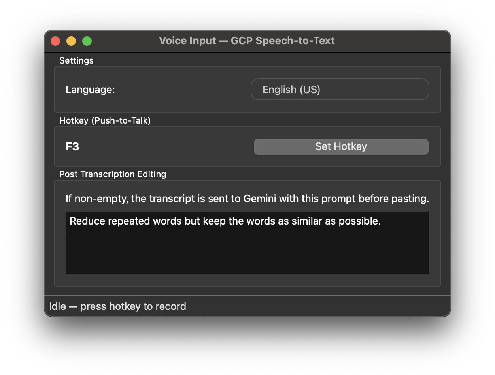

# Voice Input

<div align="center">
  
</div>

<div align="center">
  
</div>

A push-to-talk desktop app that records your voice, sends it to **Google Cloud Speech-to-Text**, and automatically pastes the transcription into whatever app has focus. Optionally post-processes the transcript with **Gemini** before pasting.

Supports macOS and Linux (X11 only; Wayland is not supported).

## Prerequisites

- **Python 3.10+**
- **Google Cloud account** will a billing account
- **gcloud CLI** — [Install guide](https://cloud.google.com/sdk/docs/install)

## GCP Setup

Run these commands once in your terminal:

```bash
# 1. Authenticate with Application Default Credentials
gcloud auth application-default login

# 2. Set your default GCP project
gcloud config set project YOUR_PROJECT_ID

# 3. Enable the Speech-to-Text API; one-time setup
gcloud services enable speech.googleapis.com

# 4. Enable the Vertex AI API (for post-processing); one-time setup
gcloud services enable aiplatform.googleapis.com
```

## Installation

```bash
# Clone the repo
git clone https://github.com/yuhao-he/voice-input-assistant.git
cd voice_input

# Create a virtual environment
python3 -m venv venv
source venv/bin/activate   # macOS / Linux
# venv\Scripts\activate    # Windows

# Install dependencies
pip install -r requirements.txt
```

## Usage

```bash
source venv/bin/activate
python main.py
```

